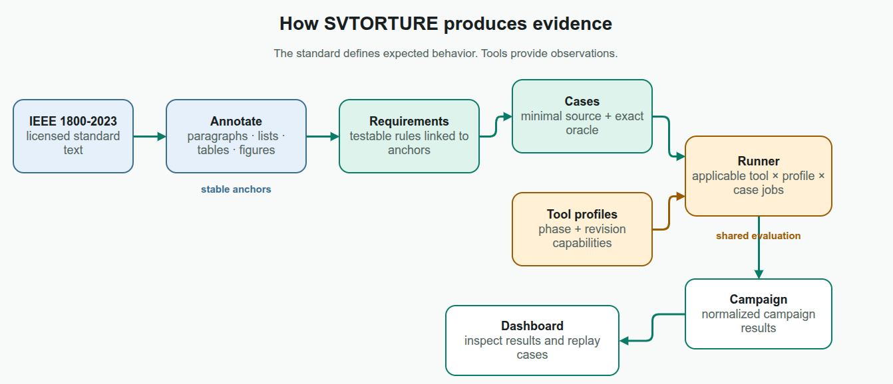
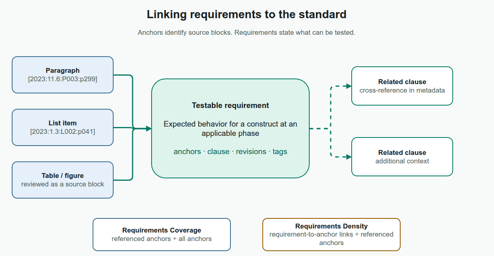
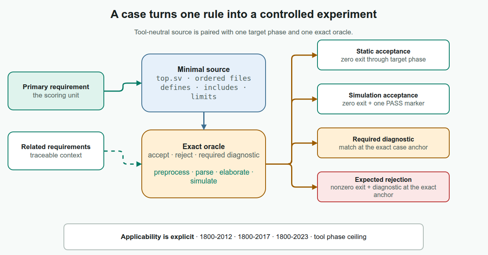
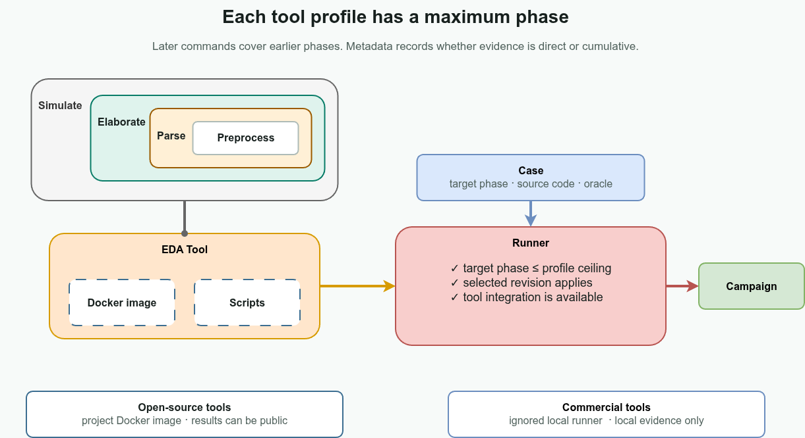
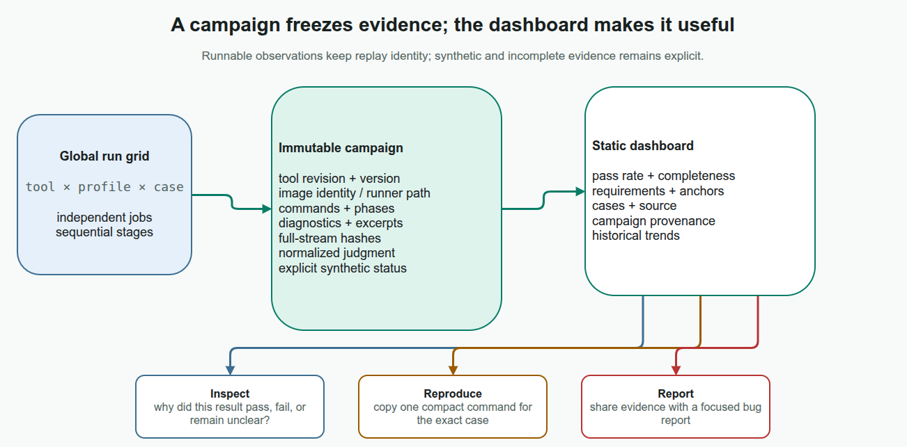

# About SVTORTURE

SVTORTURE tests SystemVerilog tools against requirements derived from the
standard. A campaign records the cases that ran, the tool observations, and the
information needed to inspect or replay a result.

This page is a short visual guide. The dashboard renders its `##` sections
straight from this file at build time; those headings also define its contents
and anchors. The detailed rules live in [architecture](../architecture.md),
[methodology](../methodology.md), and [reproduction](../reproduction.md). The
`*.drawio.png` illustrations embed their Draw.io models and can be opened in
Draw.io Desktop for editing.

## Overview

SVTORTURE tests SystemVerilog tools against requirements derived from the
standard. A campaign records the cases that ran, the tool observations, and the
information needed to inspect or replay a result.

Each case has an explicit target phase and oracle,
and every result can be traced back to a requirement. IEEE 1800-2023
supplies the normative text, and the framework does the rest.

## Requirements

A requirement is a testable statement supported by one or more anchored source
blocks, such as paragraphs, list items, tables, or figures. Its metadata records
revision applicability.

Corpus coverage is the share of eligible anchors cited after waiver-only
exclusions; density is the number of requirement-to-anchor links per cited anchor. See
[annotation](../annotation.md) for anchor construction and
[methodology](../methodology.md) for the metric definitions.

## Cases

A case turns one primary requirement into minimal, tool-neutral source and an
oracle for a specific phase.

An oracle can require static acceptance, a simulation `PASS` marker, or rejection
with a matching diagnostic at the exact case anchor. The headline pass rate requires every selected mandatory variant to conform. See [adding a case](../adding-a-case.md) for the full workflow.

## Tools

Tool phases are cumulative: parsing includes preprocessing, elaboration includes
parsing, and simulation includes elaboration. A profile states its maximum phase
and which phases it observes directly.

The runner checks phase, revision, and availability, then labels evidence as
direct, cumulative, or not observed.
Open-source revisions are resolved before Docker builds and can be published;
commercial runners and their results remain local. See
[adding a tool](../adding-a-tool.md) for integration details.

## Campaigns

A campaign contains the results for a selected set of tools, profiles, and cases.
Once written, the campaign record does not change.

Combinations run independently, but their stages remain ordered. Runnable
results retain versions, hashes,
commands, diagnostics, bounded output, and replay data. Synthetic or incomplete
results stay visible even when they cannot be replayed. Full logs and commercial
runner details remain local.

## Dashboard

The dashboard reads static campaign exports. It has no application server or
live database, and every score stays linked to its requirements and cases. Users
can inspect pass rate, completeness, source, diagnostics, output, campaign
provenance, and historical trends. Runnable results include a replay command
that can be attached to a bug report.

Public campaigns can periodically test resolved upstream mainline revisions.
Local exports may include commercial results, but the public export policy
removes them.
